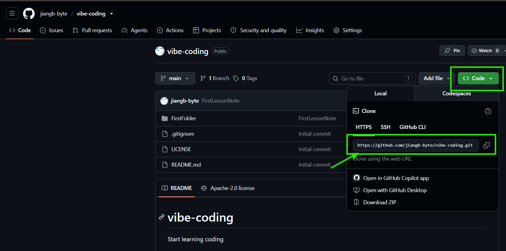

# Coding 学习笔记
My Github URL: https://github.com/jiangb-byte
You can find the training materials here: https://avaya.atlassian.net/wiki/spaces/DLBBEWIKI/pages/2398945477/Git

## Required Practice for the first topic (Git):

Sign up for a GitHub account.

Create a repository in your account.

Install Git and VS Code on your PC.

Clone the new repository to your PC and open it via VS Code.

Write your first Markdown note (Learn Git) in VS Code.

Push it to GitHub once completed.

### How to find a reposiroty link

